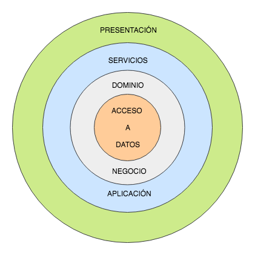
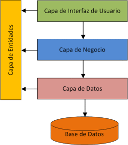

<p align="center">
  <a href="https://expressjs.com/" target="blank"></a>
</p>

[circleci-image]: https://img.shields.io/circleci/build/github/nestjs/nest/master?token=abc123def456
[circleci-url]: https://circleci.com/gh/nestjs/nest

  <p align="center">A progressive <a href="http://nodejs.org" target="_blank">Node.js</a> framework for building efficient and scalable server-side applications.</p>
 
  <!--[](https://opencollective.com/nest#backer)
  [](https://opencollective.com/nest#sponsor)-->

## Descripción

[Nest](https://github.com/nestjs/nest) API para evaluación 360 de Empleados remotos.

# Estado
En contrucción.

# Tecnologías Utilizadas

## Backend
Esta basado en el principio de Clean Architecture, con una arquitectura de capas.



### Estructura de paquetes

Se definió la siguiente taxonomía de paquetes:

* **config:** Contiene las configuraciones.
* **controller:** Maneja las solicitudes HTTP.
* **middlewares:** Define la seguridad y el manejo centrado de errores.
* **models:** Son los modelos de dominio del negocio.
* **routes:** Define las rutas para peticiones que seran manejadas por los controllers.
* **services:** Contiene lógica de negocio.




### Decisiones de Diseño
* **Separación de Concerns:** La aplicación está dividida en controladores, modelos, middlewares y rutas para mantener una clara separación entre la lógica de negocio, la manipulación de datos, la autenticación y la definición de las rutas.

* **Autenticación y Autorización:** Se utiliza JWT para manejar la autenticación y autorización de usuarios. Los middlewares de autenticación protegen las rutas que requieren permisos específicos.

* **Manejo de Errores:** Se han implementado middlewares personalizados para manejar errores y respuestas en formato JSON, asegurando una experiencia de usuario consistente en caso de errores.

* **Rate Limiting:** Se ha implementado rate limiting para prevenir el abuso de la API, limitando el número de solicitudes que un cliente puede realizar en un período de tiempo.

## Base de datos
- Se usa MongoDB.

## Instrucciones para Configurar y Ejecutar el Proyecto
### Requisitos Previos

Asegúrate de tener instalados los siguientes programas en tu máquina:

- [Node.js](https://nodejs.org/) (versión 14.x o superior)
- [MongoDB](https://www.mongodb.com/) (si no estás utilizando MongoDB en memoria para las pruebas)

### Configuración del Proyecto

1. **Clona el repositorio**
```bash
   git clone https://github.com/jsalas87/backend-evaluacion360.git
   cd backend-evaluacion360
```

2. **Instala dependencias**
```bash
    $ npm install
```

3. **Configura tu entorno**

    Crea un archivo .env en la raíz del proyecto y agrega las siguientes variables
```bash
    JWT_SECRET=tu_secreto_jwt
    MONGO_URI=mongodb://localhost:27017/tu_base_de_datos

    REDIS_HOST=tu_host_redis
    REDIS_PORT=tu_puerto_redis
    REDIS_EXPIRE=tu_expire_redis
```

4. **Ejecuta la aplicación**

    Para iniciar el servidor, usa el siguiente comando:
```bash
    # development
    $ npm start

    # o Bien
    $ npx nodemon app.js

```

## Tests

Para ejecutar los tests unitarios e integrales, usa el siguiente comando:

```bash
    # Unit tests
    $ npm  test
```
Esto ejecutará todos los tests definidos en el directorio /tests. Los tests incluyen:

* **Tests Unitarios:** Verifican la lógica de los controladores y otros módulos individuales.
* **Test de Integración:** Verifican la interacción entre los diferentes componentes del sistema, como la integración de rutas y bases de datos.


## Notas Adicionales

- El archivo 360.postman_collection.json es una colección de postman con los curl de los servicios expuestos.
- El directorio colecciones tiene las colecciones de postman de cada documento. Para comenzar a realizar algunas pruebas.

# Autor
[<br><sub>Juan Salas</sub>](https://github.com/jsalas87)


